Olá, primeiramente gostaria de adradecer a oportunidade. 
Abaixo colocarei imagens de cada tarefa e subtarefa funcionando para mais rápido visualização de como ficou, caso queira olhar antes de avaliar o código. 

:small_blue_diamond: Cadastro de novos usuários e senha. Deve permitir associar um usuário a uma conta.

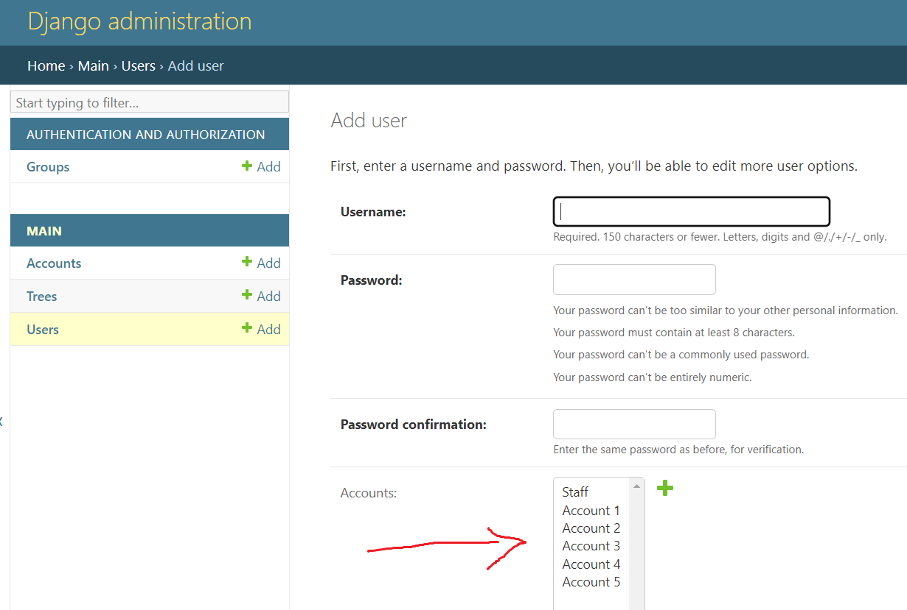

:small_blue_diamond: Listagem e criação de contas (modelo Account).Permitindo desativar e ativar as contas:

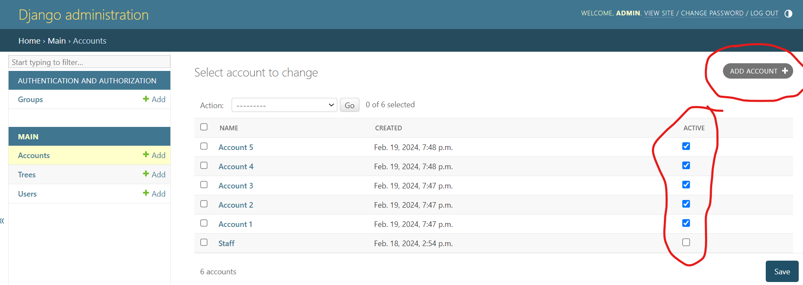

:small_blue_diamond: Cadastro e visualização de plantas

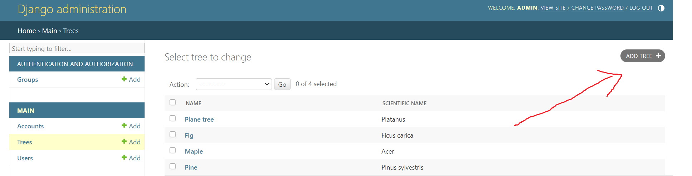

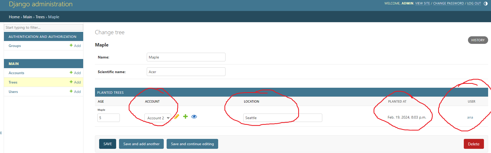

:small_blue_diamond:Fazer login de um usuário que foi cadastrado pelo admin.

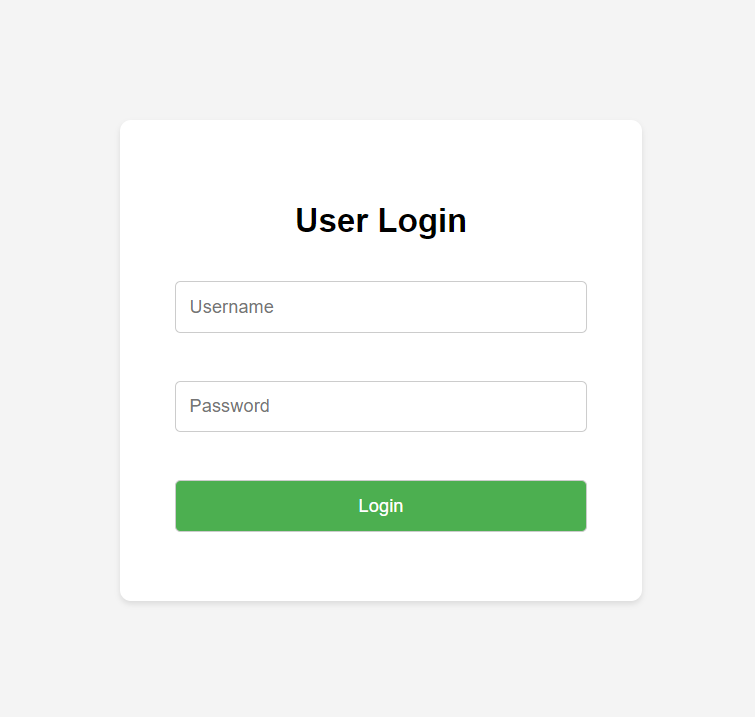

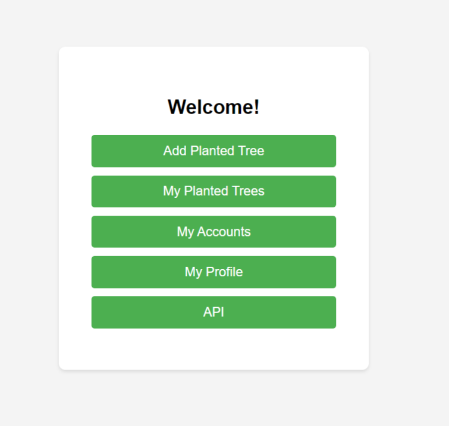

:small_blue_diamond:Editando o perfil.

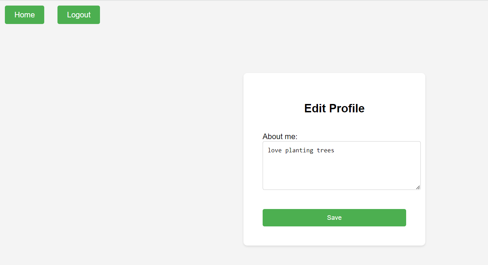

:small_blue_diamond:Visualizar as árvores plantadas por um usuário.

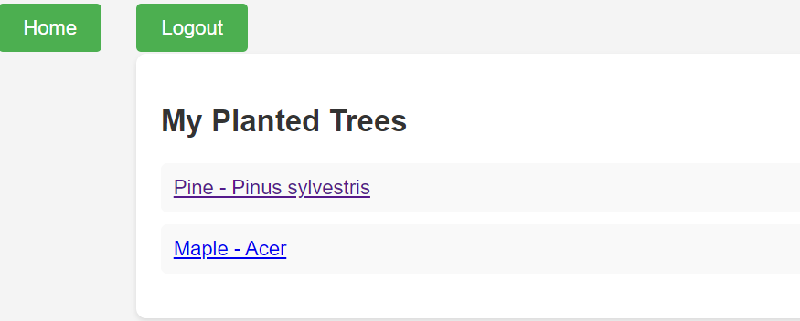

:small_blue_diamond:Exibir os dados de uma árvore plantada selecionada.

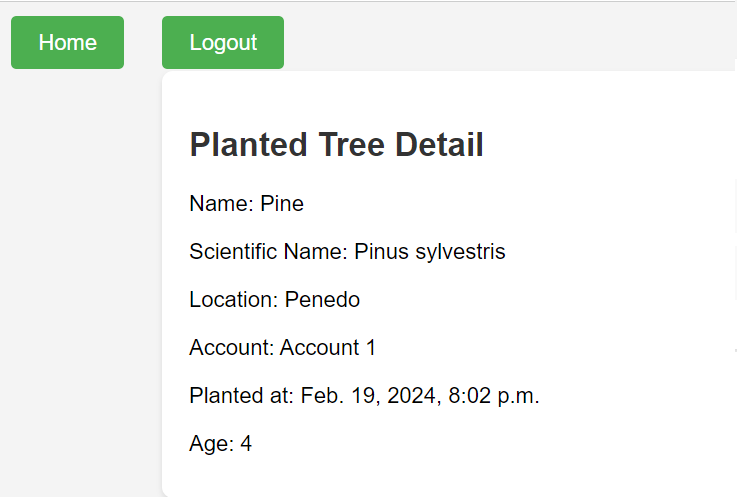

:small_blue_diamond: Adicionar uma árvore plantada.

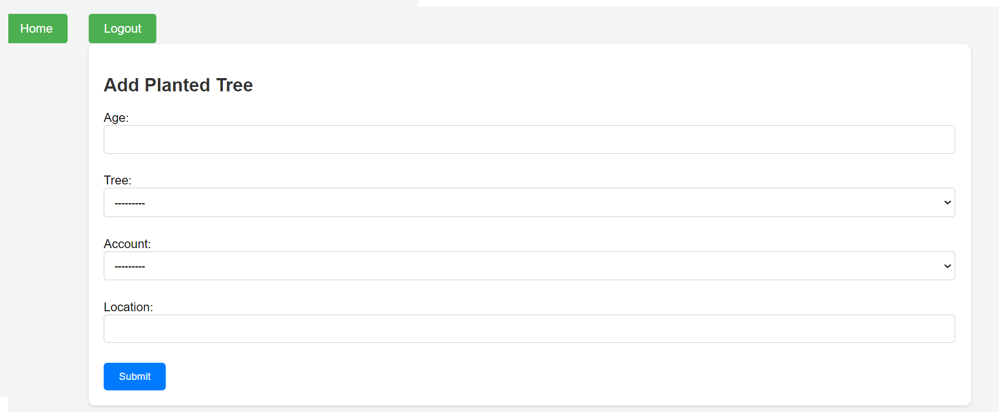

:small_blue_diamond: Exibir todas as árvores plantadas nas contas de que o usuário faz parte

:small_blue_diamond: Criar um método de api REST que retorne (em formato json) uma lista de todas as árvores plantadas pelo usuário logado atualmente.

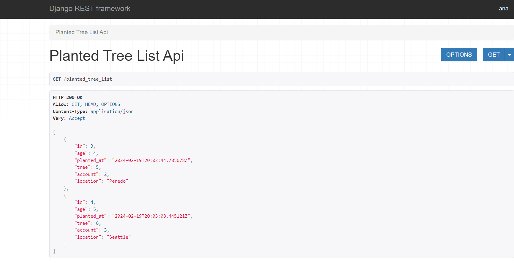

Obs: Infelizmente não consegui concluir a etapa de Testes a tempo. É um assunto que possuo pouco conhecimento e preciso estudar mais um pouco a respeito. Pretendo concluir essa tarefa até o fim da semana e fazer um push aqui. Se puderem me dar mais uns dias para a conclusão dessa ultima tarefa seria ótimo! Agradeco mais uma vez a oportunidade. 
